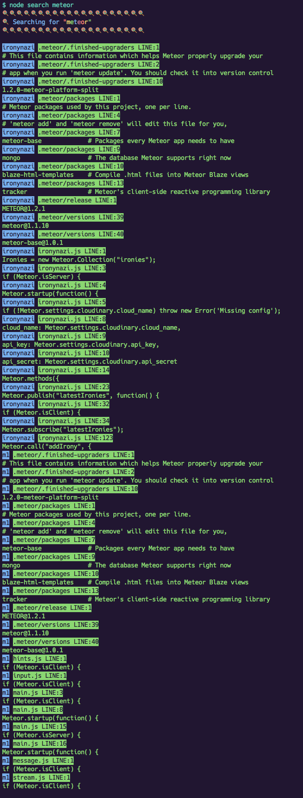

# git-mulit-project-search
"because gitlab < 8.5"

## u need
- node
- grunt

## setup
- clone this repo ```git clone git@github.com:k9ordon/git-mulit-project-search.git```
- ```npm install```
- dublicate ```.repos.example.json``` to ```.repos.json``` and add the repos u want to search trough
- run ```grunt``` (clones all the repos)

## usage
- ```node search yolo``` (where ```yolo``` is your searchterm)
- profit

## example


